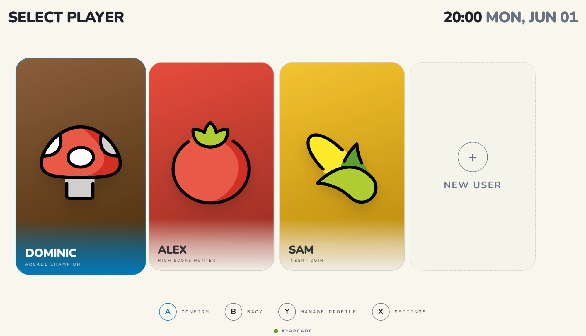

# kyarcade

A full-screen, gamepad-driven profile switcher for shared arcade cabinets. Each player gets their own isolated EmulationStation (ES-DE) config. Select a profile and ES-DE launches with that player's settings, controller maps, collections, and save-state metadata.



---

## The problem

On a shared cabinet, ES-DE stores everything in one config directory. One player's controller mappings overwrite another's. Collections and favorites are shared. There's no concept of separate users.

Kyarcade adds a profile selection screen in front of ES-DE. Each profile gets its own ES-DE config directory. Picking a profile swaps in that config via symlink, then launches ES-DE.

---

## How it works

```
Player selects profile
        ↓
~/ES-DE symlink is pointed at that profile's ES-DE/ folder
        ↓
ES-DE launches and reads config from there
```

Profile data is never copied or deleted. Only the symlink target changes.

---

## Requirements

- Linux (tested on Bazzite)
- Node.js + npm
- `ES-DE.AppImage` at `$HOME/Applications/ES-DE.AppImage`
- ROMs at `$HOME/Emulation/roms`

### Directory structure

```
$HOME/
  Applications/
    ES-DE.AppImage
  Emulation/
    roms/
  es-profiles/
    {profile-id}/
      profile.json
      avatar.png          (optional)
      ES-DE/              (this player's ES-DE config)
  ES-DE -> es-profiles/{active-id}/ES-DE   (symlink, managed by kyarcade)
```

On first use, populate each profile's `ES-DE/` by running ES-DE once per profile, or copy an existing config in manually.

---

## Setup

### Clone and run

```bash
git clone https://github.com/kyabetsu4/kyarcade.git
cd kyarcade
./run.sh
```

`run.sh` installs dependencies on the first run, builds the app, and launches it full-screen.

To update: `git pull && ./run.sh`

### Autostart on boot

Point your desktop autostart or a systemd user service at `run.sh`.

---

## AppImage

To build a standalone AppImage that doesn't require Node.js on the target machine:

```bash
npm install
npm run electron:build
```

Output: `release/kyarcade-<version>.AppImage`

To install and set up autostart:

```bash
./install.sh
```

AppImages must be built on Linux.

---

## Development

```bash
npm run dev
```

Starts the Vite dev server at `http://localhost:5173`. IPC calls to ES-DE are no-ops outside Electron.

---

## Scripts

| Command | What it does |
|---|---|
| `./run.sh` | Install, build, and launch |
| `npm start` | Build and launch Electron |
| `npm run electron:build` | Build AppImage to `release/` |
| `npm run build:electron` | Vite build for Electron (relative asset paths) |
| `npm run build` | Vite build for the web demo (GitHub Pages) |
| `npm run dev` | Vite dev server |
| `npm run lint` | ESLint |
| `npm run format` | Prettier |

---

## Controls

| Button | Action |
|---|---|
| A | Confirm |
| B | Back |
| X | Settings |
| Y | Manage Profile |
| D-pad / Left stick | Navigate |

Button glyphs match the connected controller. Xbox controllers show A/B/X/Y, DualShock/DualSense show the PlayStation symbols.

---

## Boot screen

The message shown on the loading screen is customizable from Settings. You can also hide the kyarcade branding entirely and show only your own message.

---

## Themes

Six themes, selectable from Settings: Default, Dark, Arcade, Synthwave, Sunset, Ocean.

---

## Avatars

16 built-in avatars from [OpenMoji](https://openmoji.org/), bundled with the app. Custom image upload (JPG, PNG, WebP) is supported per profile.

---

## Stack

- [React 19](https://react.dev/) + TypeScript
- [Vite 7](https://vitejs.dev/)
- [TanStack Router](https://tanstack.com/router)
- [Electron 42](https://www.electronjs.org/)
- [Tailwind CSS 4](https://tailwindcss.com/)

---

## License

MIT
